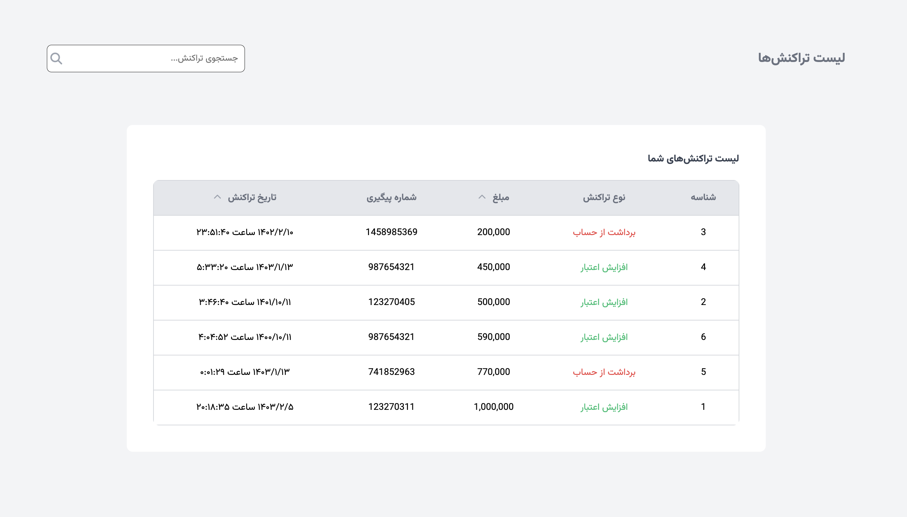

# Transaction-Manager

A **JavaScript project** that dynamically fetches and displays transaction data from an API, allowing users to search, sort, and interact with the data seamlessly.

## Features

1. **Fetch Data from API**  
   Transactions are fetched dynamically using `axios` from a local API endpoint (`http://localhost:3000/transactions`).

2. **Search Functionality**

   - Users can search for transactions by `refId` using a real-time search box.
   - The app filters results by appending a query parameter (`?refId_like=<searchTerm>`).

3. **Sorting Functionality**

   - Transactions can be sorted by `price` or `date` in ascending (`asc`) or descending (`desc`) order.
   - Sorting works dynamically, even when the data is filtered via search.

4. **Dynamic Table Rendering**

   - The data is displayed in a responsive, styled table.
   - Each transaction displays details such as ID, type, price, reference ID, and date.

5. **Interactive UI Elements**
   - Sorting icons update dynamically to indicate the current sort order (e.g., up/down arrows).
   - Seamless integration between search and sorting features.

## Technology Stack

- **Frontend**: Vanilla JavaScript, HTML, CSS
- **Backend (API)**: JSON Server (for local API simulation)
- **Libraries**: [Axios](https://axios-http.com/) for API requests

## Screenshots

